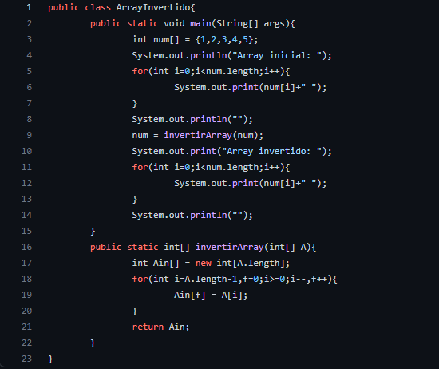
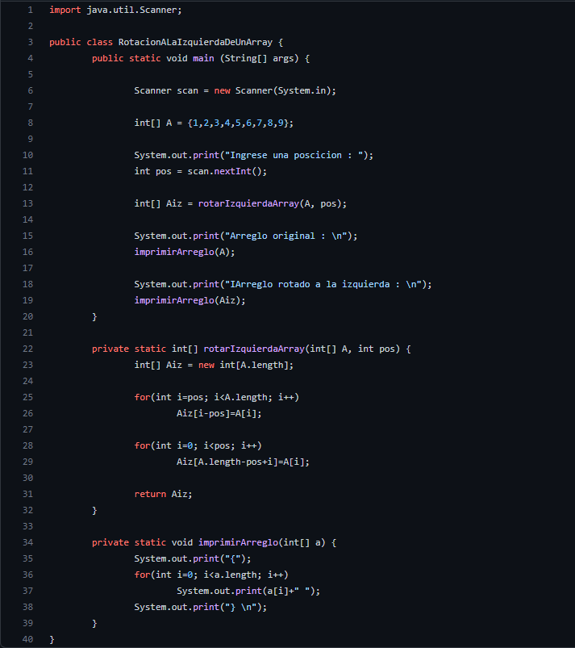
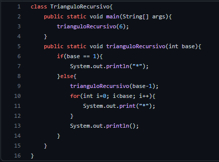
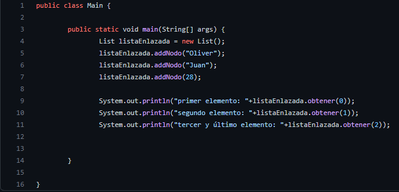
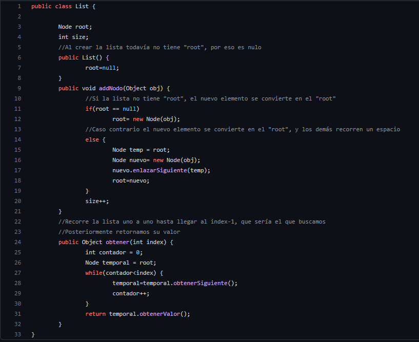
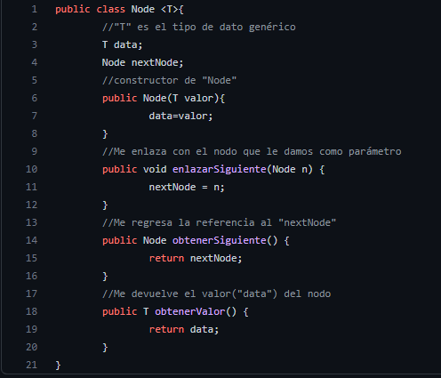

<table>
    <theader>
        <tr>
            <td></td>
            <th>
                UNIVERSIDAD NACIONAL DE SAN AGUSTIN 
                FACULTAD DE INGENIERÍA DE PRODUCCIÓN Y SERVICIOS 
                ESCUELA PROFESIONAL DE INGENIERÍA DE SISTEMAS
            </th>
            <td></td>
        </tr>
    </theader>
    <tbody>
        <tr><td colspan="3">Formato: Guía de Práctica de Laboratorio</td></tr>
        <tr><td>Aprobación:  2022/03/01</td><td>Código: GUIA-PRLD-001</td><td>Página: 1</td></tr>
    </tbody>
</table>

 <h3>INFORME DE LABORATORIO</h3>

<table>
 <theader>
  <tr><th colspan="6" bgcolor="red">INFORMACIÓN BÁSICA</th></tr>
 </theader>
 <tbody>
  <tr><td>ASIGNATUA:</td><td colspan="5">Estructura de Datos y Algoritmos</td></tr>
  <tr><td>TÍTULO DE LA PRACTICA:</td><td colspan="5">Revisión de elementos de programación(Parte I)</td></tr>
  <tr><td>NÚMERO DE PRÁCTICA:</td><td>Practica de Laboratorio 02</td><td>AÑO LECTIVO:</td><td>2022 A</td><td>NRO. SEMESTRE:</td><td>III</td></tr>
  <tr><td>FECHA DE PRESENTACIÓN:</td><td>10/05/22</td><td>HORA DE PRESENTACIÓN:</td><td colspan="3">11:30 p.m.</td></tr>
  <tr><td>INTEGRANTES:</td><td colspan="3">-Diego Ivan Pacori Anccasi -Edson Joel López Quispe -Oliver Alessandro Mayta Nolasco -Edwin Francisco Aguilar Tancayo -Jordy Emanuel Ayma Cutipa</td><td>NOTA:</td><td>...</td></tr>
  <tr><td>DOCENTE:</td><td colspan="5">Richart Smith Escobedo Quispe - rescobedoq@unsa.edu.pe</td></tr>
 </tbody>
</table>
<table>
 <theader>
  <tr><th>SOLUCIÓN Y RESULTADOS</th></tr>
 </theader>
 <tbody>
  <tr><td><strong>I. SOLUCIÓN DE EJERCICIOS/PROBLEMAS:</strong> 
  <ul>
    <li> 
        
invertir el Array

        
    </li>
    <li>
        
Rotación a la Izquierda

        
    </li>
    <li>
        
Triángulo recursivo

        
    </li>
    <li>
        <ol>
            <li>Implemente una Lista usando POO con tipos genéricos siguiendo los estándares de Java</li>
            <li>Implemente una clase Node donde T es un tipo genérico, esta clase debe contener al menos dos propiedades</li>
            <li>Implementar una clase List esta clase debe contener al menos dos propiedades</li>
        </ol>
        <ul>
            <li>
                
Clase main

                
            </li>
            <li>
                
Clase List

                
            </li>
            <li>
                
Clase Node

                
            </li>
        </ul>
    </li>
  </ul>
  </td></tr>
  <tr><td><strong>II. CUESTIONARIO:</strong> *¿Qué diferencia hay entre un List y un ArrayList en Java? - Una lista es una interfaz y ArrayList es una clase de colección estándar. - La interfaz de lista amplamplía el marco de la Colección, en cambio ArrayList extiende la clase AbstractList e implementa las interfaces de lista. - La interfaz de lista crea una colección de elementos que se almacenan en una secuencia y se identifican o acceden mediante su número de índice. Por otro lado, ArrayList crea una matriz de objetos donde la matriz puede crecer dinámicamente cuando sea necesario. - En una lista no se pueden crear instanciaciones, en ArrayList si se puede instanciar. *¿Qué beneficios y oportunidades ofrecen las clases genéricas en Java? - Las clases genéricas porporcionan los medios para describir el concepto de pila(o cualquier otra clase).  De esta manera podemos crear instancias de objetos con tipos específicos y de la clase genérica y nos da la oportunidad de reutilizar el software. - En tiempo de compilación, el compilador de Java asegura la seguridad de los tipos de nuestro código y utiliza las técnicas de borrado para permitir que nuestro código interactúe con la clase genérica.
  </td></tr>

  <tr><td><strong>III. CONCLUSIONES:</strong> - El ArrayList surge del problema que no se puede aumentar o disminuir el tamaño de una matriz estática en java. - La clase ArrayList amplía la interfaz de lista.
  </td></tr>
 </tbody>
</table>

<table>
 <theader>
  <tr><td>RETROALIMENTACIÓN GENERAL 
  Se nos presentaron tres ejemplos de estructura de datos, Array,Iterator y Listas, herramientas muy útiles, cuando de almacenar y navegar entre datos se trata, esto se refuerza con los ejercicios propuestos, para la resolución se utilizaron conocimientos en Arreglos, Recursión y el tema de  nuevo, Listas que requirió información adicional.
  </td><tr>
 </theader>
 <tbody>
  <tr><td></td></tr>
 </tbody>
</table>

<table>
 <theader>
  <tr><td>REFERENCIAS Y BIBLIOGRAFÍA</td><tr>
 </theader>
 <tbody>
  <tr><td>https://docs.oracle.com/javase/7/docs/api/java/util/List.html</td></tr>
  <tr><td>https://docs.oracle.com/javase/tutorial/java/generics/types.html</td></tr>
  <tr><td>https://www.w3schools.com/java/</td></tr>
 </tbody>
</table>
